# sv

Everything you need to build a Svelte project, powered by [`sv`](https://github.com/sveltejs/cli).

## Creating a project

If you're seeing this, you've probably already done this step. Congrats!

```bash
# create a new project in the current directory
npx sv create

# create a new project in my-app
npx sv create my-app
```

## Developing

Once you've created a project and installed dependencies with `npm install` (or `pnpm install` or `yarn`), start a development server:

```bash
npm run dev

# or start the server and open the app in a new browser tab
npm run dev -- --open
```

## Building

To create a production version of your app:

```bash
npm run build
```

You can preview the production build with `npm run preview`.

> To deploy your app, you may need to install an [adapter](https://svelte.dev/docs/kit/adapters) for your target environment.

## More information

```mermaid
graph TD
    A[Current State of Technology/Field] --> B[Current Problems]
    B --> C[Evolution & Progress]
    C --> D[Unresolved Problems]
    D --> E[Solved Issues]
    E --> F[Issue 1: Containerization simplifies deployment]
    E --> G[Issue 2: Docker Swarm enables lightweight orchestration]
    E --> H[Issue 3: Traefik provides dynamic routing]
    D --> I[Unresolved Issues]
    I --> J[Issue 1: Complex setup for zero-downtime without Kubernetes]
    I --> K[Issue 2: Lack of integration between Docker Swarm and Traefik for blue-green]
    I --> L[Issue 3: Manual intervention required for traffic switching]
    A --> M[Existing Approaches]
    M --> N[Solution Type 1: Kubernetes-based Blue-Green]
    M --> O[Solution Type 2: Manual Scripting for Deployment]
    N --> P[Limitations 1: Kubernetes]
    P --> Q[Limit 1: High resource overhead]
    P --> R[Limit 2: Complex configuration]
    P --> S[Limit 3: Overkill for small-scale applications]
    O --> T[Limitations 2: Manual Scripting]
    T --> U[Limit 1: Prone to human error]
    T --> V[Limit 2: Lack of automation]
    T --> W[Limit 3: Time-consuming]
    A --> X[Identified Gap]
    X --> Y[Need for a lightweight, automated blue-green deployment solution using Docker Swarm and Traefik]
    A --> Z[Technical Foundation]
    Z --> AA[Foundation Component 1: Docker Containerization]
    AA --> AB[Element 1: Isolated environments for blue/green]
    AA --> AC[Element 2: Portability and consistency]
    AA --> AD[Element 3: Simplified dependency management]
    Z --> AE[Foundation Component 2: Docker Swarm + Traefik]
    AE --> AF[Element 1: Lightweight orchestration]
    AE --> AG[Element 2: Dynamic traffic routing]
    AE --> AH[Element 3: Automatic load balancing]
    A --> AI[PROPOSED SOLUTION]
    AI --> AJ[Value Proposition]
    AJ --> AK[Benefit Category 1: Technical]
    AK --> AL[Benefit 1: Zero downtime during deployment]
    AK --> AM[Benefit 2: Simplified setup without Kubernetes]
    AK --> AN[Benefit 3: Automated traffic switching]
    AJ --> AO[Benefit Category 2: Operational]
    AO --> AP[Benefit 1: Reduced manual intervention]
    AO --> AQ[Benefit 2: Scalable for small to medium applications]
    AO --> AR[Benefit 3: Cost-effective resource usage]
```
